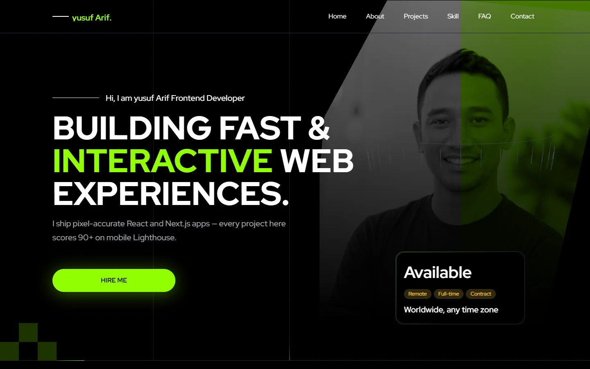
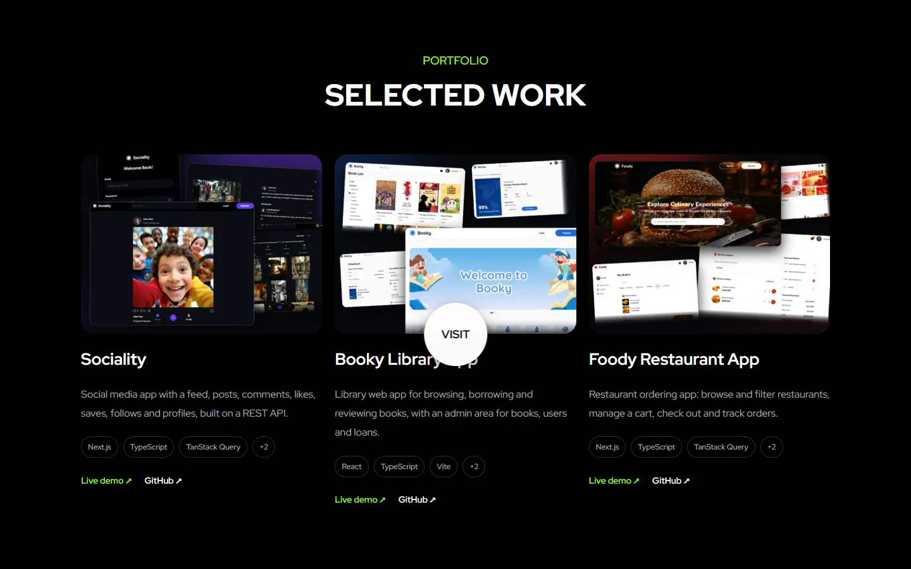
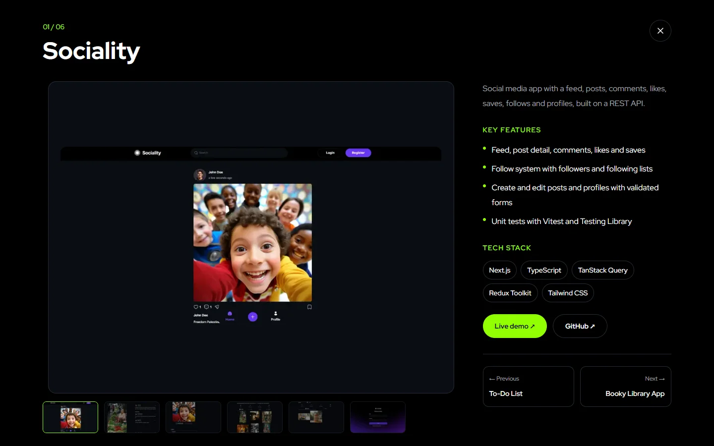
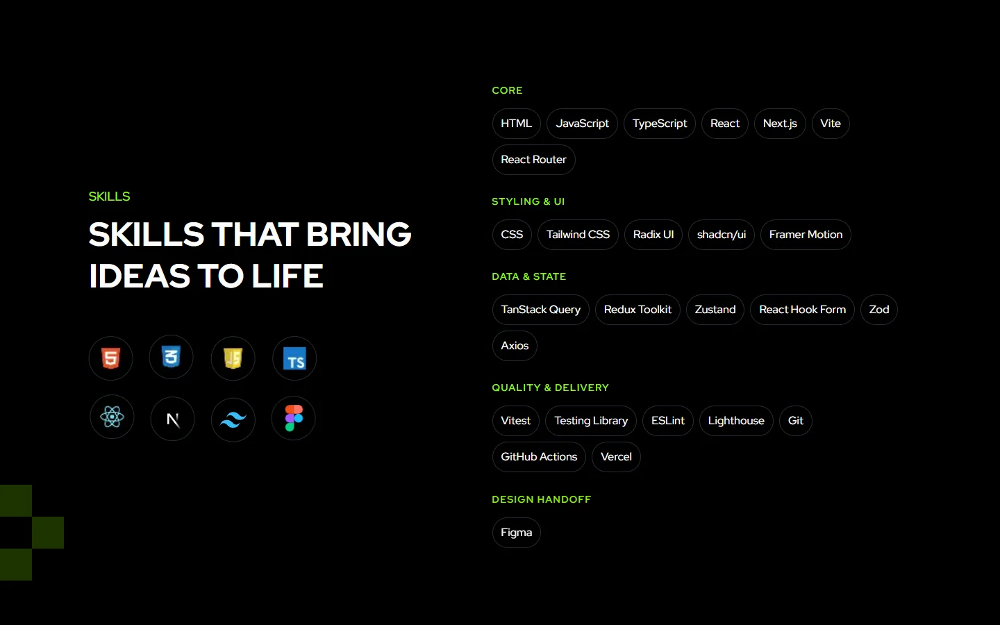
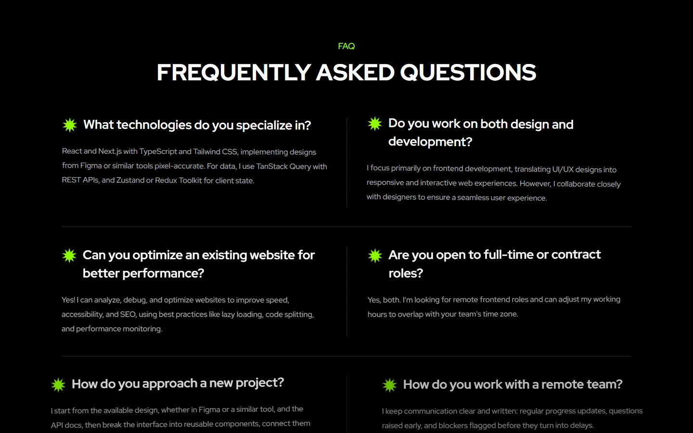
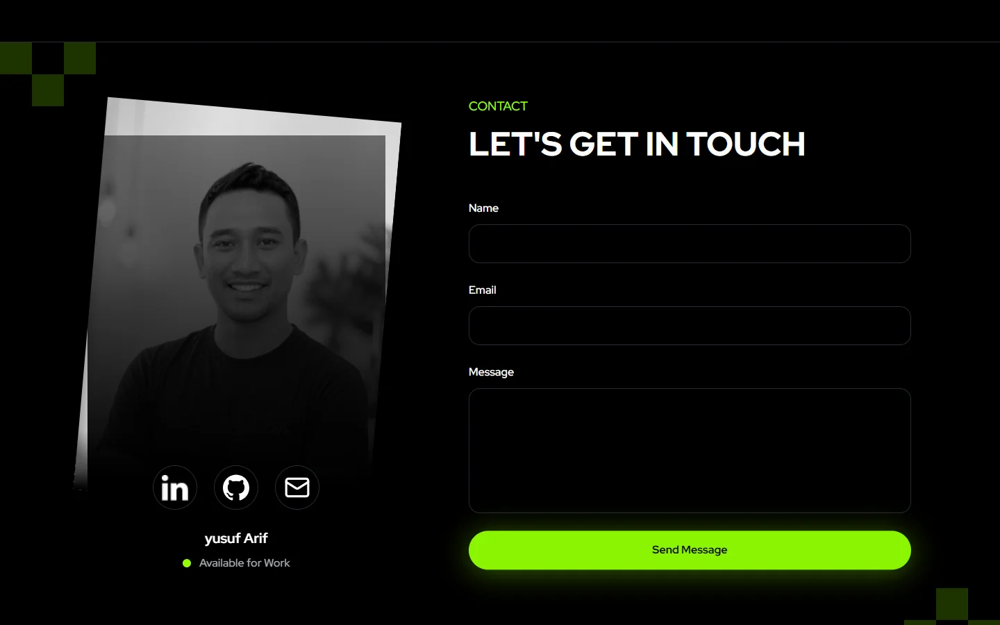

# yusuf Arif — Frontend Developer Portfolio

[](https://github.com/Yusuf-98/Portfolio-yusuf-Arif/actions/workflows/ci.yml)

My personal portfolio: who I am, the projects I have shipped, the stack I work with and how to reach me. Each project opens in a detail view with a screenshot gallery, key features, tech stack and links to the live demo and source code.

Built with Next.js, TypeScript, Tailwind CSS and Framer Motion.

🚀 **Live site:** https://yusuf-arif.vercel.app

<p align="center">
  
</p>


## Features

- **Hero**: typewriter role rotation and a photo reveal that follows the cursor on desktop; on touch screens a tap locks the reveal in place.
- **Projects**: some of my live projects in a responsive grid. A card opens a detail dialog with a screenshot gallery, key features, tech stack, live demo and GitHub links, and previous/next navigation. A second dialog lists every project in one compact view.
- **Accessible dialogs**: both dialogs are built on Radix Dialog, so focus is trapped inside, returns to the card that opened it, Escape closes it and the page behind does not scroll.
- **Skills**: floating tech icons plus the full stack grouped by area (core, styling and UI, data and state, quality and delivery, design handoff).
- **Why choose me and journey**: a two-column comparison that slides in with the scroll and stays pinned while the career timeline scrolls in beneath it.
- **FAQ**: a two-column grid on desktop and an accordion on mobile, with real buttons and `aria-expanded` so it works by touch, keyboard and screen reader.
- **Contact**: a validated form that delivers messages by email through [Web3Forms](https://web3forms.com), with success and error states. Social links point to LinkedIn, GitHub and email; the email address is only assembled when the link is clicked, which keeps it out of the page source.
- **Sharing**: an Open Graph image and description for link previews on LinkedIn and other platforms.

## Screenshots

| | |
| --- | --- |
|  |  |
| **Projects** — some of my live projects | **Project detail** — gallery, features, stack and links |
|  |  |
| **Skills** — icons and grouped stack | **FAQ** |



## Tech stack

- **Next.js 16** (App Router) + **React 19** + **TypeScript**
- **Tailwind CSS v4** with a custom design token theme
- **Framer Motion** for entrance, scroll-linked and hover animations
- **Radix UI Dialog** for the project dialogs
- **Web3Forms** for contact form delivery
- **ESLint** and **GitHub Actions** for CI, **Vercel** for hosting

## Getting started

Requires Node.js 22 or newer.

```bash
git clone https://github.com/Yusuf-98/Portfolio-yusuf-Arif.git
cd Portfolio-yusuf-Arif
npm install
cp .env.example .env.local
```

Fill in the contact form key in `.env.local`:

| Variable | Description |
| --- | --- |
| `NEXT_PUBLIC_WEB3FORMS_KEY` | Access key from [Web3Forms](https://web3forms.com). Without it the site still runs, but the contact form shows its error state. |

Then start the dev server and open `http://localhost:3000`:

```bash
npm run dev
```

| Command | Description |
| --- | --- |
| `npm run dev` | Start the development server |
| `npm run build` | Build for production |
| `npm run start` | Serve the production build |
| `npm run lint` | Run ESLint |
| `npx tsc --noEmit` | Type-check only |

GitHub Actions runs lint, type-check and the production build on every push and pull request ([ci.yml](.github/workflows/ci.yml)).

## Project structure

```
app/                  # Root layout, metadata, page and Open Graph image
components/
├── hero/             # Photo reveal and typewriter logic
├── layout/           # Navbar, footer, container
├── portfolio/        # Project card, detail dialog and project list dialog
├── sections/         # One component per page section
├── service/          # Expertise cards
├── ui/               # Buttons, form fields, FAQ items and other primitives
└── work/             # Journey timeline
lib/
├── animations/       # Shared Framer Motion variants and effects
└── data/             # Project data (copy, gallery, stack, links)
public/               # Images, icons and project screenshots
docs/screenshots/     # Images used in this README
```

Project content lives in [lib/data/projects.ts](lib/data/projects.ts), so adding or editing a project does not touch any component.

## Deployment

Deployed on Vercel from the `main` branch. Set `NEXT_PUBLIC_WEB3FORMS_KEY` in the Vercel project's environment variables; it is read at build time, so redeploy after changing it.

## Author

Built by [Yusuf Arif Rahman](https://www.linkedin.com/in/yusuf-ar/) · [GitHub](https://github.com/Yusuf-98)

## License

The code is licensed under the [MIT License](LICENSE). Personal photos and project screenshots are not covered by the license.
